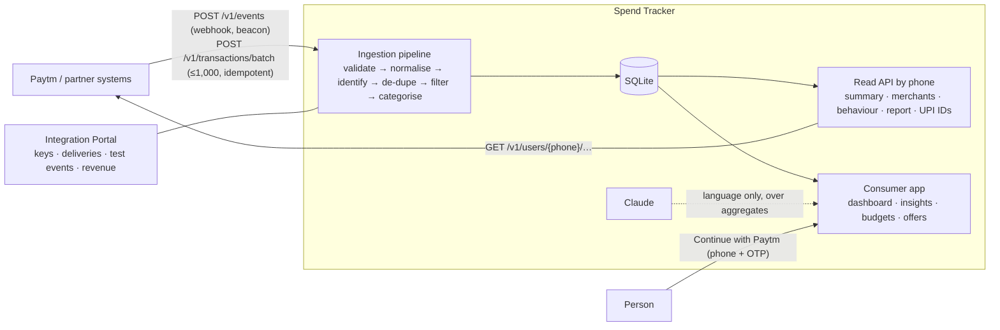

# Spend Tracker

**UPI payments in, people out.** Partners like Paytm stream UPI payments to one API; Spend Tracker cleans them, drops what isn't spending, categorises every rupee deterministically and keeps a living profile per phone number — readable by the partner (summaries, apps used, behaviour, monthly reports) and by the person themselves in a premium consumer app with Claude-written insights and spend-based offers.

**Stack:** React 19 · Vite 8 · Tailwind 4 · Motion · Recharts · Node 24 · Express 5 · SQLite (`node:sqlite`) · Claude via the Anthropic SDK or Claude Agent SDK · pnpm workspaces



## Quick start

```bash
pnpm install
pnpm dev              # API :4400 · app http://localhost:5273
cp .env.example .env  # optional: OTP_DEMO=1 shows sign-in codes on screen (no SMS in the demo)
```

| Surface | URL | Who |
|---|---|---|
| Consumer app | `/` → **Continue with Paytm** (phone + OTP) or a demo persona | People |
| Partner API | `/v1` · `Authorization: Bearer stk_live_…` | Partner systems |
| Developer docs | `/docs` (generated from the same spec the server uses; OpenAPI at `/v1/openapi.json`) | Partner engineers |
| Integration Portal | `/portal` | Partner admins |

**Demo accounts**

| Who | Sign in |
|---|---|
| Rohan — convenience spender (Bengaluru): ~79 delivery orders/month, Netflix + Hotstar overlap, duplicate Swiggy charge, 1 a.m. ₹38,990 laptop | phone `98765 00001` |
| Neha — deal-hunting fashionista (Mumbai) | phone `98765 00002` |
| Kabir — subscription collector (Pune) | phone `98765 00003` |
| Integration Portal (Paytm) | `integrations@paytm.demo` / `paytm-partner-2026` (development only; production requires `PORTAL_ADMIN_PASSWORD`) |

Email login also works for the personas (`rohan@demo.spendtracker.app`, password `spend-smart-2026`). `pnpm seed` resets them.

## Partner API in 30 seconds

Create a key in the portal (**API keys → Create key**; the secret is shown once), then:

```bash
# Webhook: one payment as it settles (also accepts text/plain for navigator.sendBeacon)
curl localhost:4400/v1/events -H "Authorization: Bearer $STK_KEY" -H "Content-Type: application/json" \
  -d '{"id":"PTM-1","phone":"+91 98765 00009","amount":"₹349","timestamp":"2026-10-06T13:12:45+05:30",
       "payee_vpa":"swiggy.payu@hdfcbank","payee_name":"PAYTM*SWIGGY LIMITED 4412093","payer_vpa":"aarav.s@paytm"}'
# → 202 {"status":"accepted","transaction":{"merchant":"Swiggy","category":"food","subcategory":"food_delivery","confidence":0.97,…}}

# Read the person behind the phone
curl "localhost:4400/v1/users/9876500001/behavior" -H "Authorization: Bearer $STK_KEY"
# → spender type, preferred apps per subcategory (Swiggy 58% / Zomato 42%), peak times, subscriptions, UPI IDs…
```

| Endpoint | Purpose |
|---|---|
| `POST /v1/events` | One payment (webhook / beacon / `{object:"event",data}` envelope). `202`, or `422` if invalid |
| `POST /v1/transactions/batch` | ≤ 1,000 payments (JSON, array or NDJSON), atomic, per-item results, `Idempotency-Key` replay |
| `GET /v1/ingest/logs[/{id}]` | Delivery history with per-item outcomes |
| `GET /v1/users/{phone}` · `/summary` · `/categories` · `/merchants` · `/behavior` · `/report` · `/upi-ids` · `/transactions` | Read by phone; windows: `period=7d…12m,overall`, `month=YYYY-MM`, or `from`/`to` |
| `GET /v1/users/{phone}/offers` · `POST /v1/offers/events` | Spend-based offers and impression/click/conversion reporting |
| `PUT /v1/users/{phone}/consent` · `DELETE /v1/users/{phone}` | Consent mirroring and DPDP erasure |
| `GET /v1/segments[/{id}]` · `GET /v1/categories` | Aggregate audiences and the taxonomy |

### The ingestion pipeline (deterministic — no AI)

1. **Validate** required fields, types, ranges → `rejected` with `code` + `param` (`invalid_phone`, `invalid_vpa`, `invalid_timestamp`, …).
2. **Normalise** phone (`+91`/`0` stripped), amount (`"₹1,249.50"` ok), UPI IDs, payee names (`PAYTM*`, `UPI-`, `RZP*` prefixes, reference numbers and `Pvt Ltd` suffixes stripped).
3. **Identify** the user by phone — UPI IDs change, phones don't — and record every payer UPI ID.
4. **De-duplicate** by your `id` (resending a new final status updates the payment, e.g. `success → reversed`) and by UPI `rrn`.
5. **Filter junk**: credits, pending, self-transfers between the user's own UPI IDs, ₹1 penny-drop tests, > 3 years old.
6. **Categorise**: user corrections → merchant catalog (name or UPI ID handle) → MCC (≈60 codes) → keywords → person/P2P heuristics, each with `confidence` and `categorised_by`.

### Security & privacy model

- Keys are `stk_live_…`, unbiased random, shown once, stored as SHA-256, scoped (`transactions:write`, `users:read`, `users:write`, `segments:read`, `offers:read`, `offers:write`), revocable, rate-limited per key; every response has `X-Request-Id` and errors share one envelope.
- **Tenant isolation:** partners see only users linked to them (onboarded through their ingestion, or who signed in with them). Other phones return `404`; payments for them are `rejected: user_not_linked`.
- **Consent is per partner.** Partners can always withdraw it; only the onboarding partner can grant it — app users grant it themselves. Erasure deletes onboarded users fully, otherwise only the partner's data and link.
- Portal sessions use a separate JWT audience from the app. Demo-only conveniences (portal password, on-screen OTP) are disabled in production unless explicitly configured.

## The consumer app

| Feature | Where |
|---|---|
| Overview: orbital spend dial with vs-previous change, categories with per-category deltas, "where it went", stats, offers, Claude briefing (cached on a data fingerprint), insight tiles, savings | `pages/Dashboard.jsx` |
| Deep dives: sub-categories, merchants (Swiggy vs Zomato), delivery fees, peak times, peers | `pages/Category.jsx`, `pages/Merchant.jsx` |
| Trends: glass monthly columns, weekday × hour star map, anomalies, subscriptions | `pages/Trends.jsx` |
| Save money, budgets, alerts, offers (personalised first), Ask your money (Claude), CSV/PDF export | `pages/*`, `/api/*` |
| Dark (true black) and light (porcelain) themes, mobile-first layouts | `index.css`, `components/ui.jsx` |

**AI** is picked automatically (`GET /api/health`): `ANTHROPIC_API_KEY` → local Claude Code login via the Claude Agent SDK → built-in engine. Every number comes from the engine; Claude only writes language over aggregates, and any failure falls back instantly.

## Honesty notes for the demo

- Persona histories are generated (deterministic per user) to stand in for Paytm's feed; partner-API ingestion is real.
- Peer comparisons use illustrative cohort benchmarks; delivery fees are estimated at ₹45/order.
- Demo profiles include 30 days of simulated offer events so revenue isn't empty (the portal says so). Offers and coupon codes are samples.
- There is no SMS provider: with `OTP_DEMO=1` the sign-in code is shown on screen.

## Layout

```
server/src
  partner/   ingest.js (pipeline, MCC map) · keys.js (scoped hashed keys) · spec.js (docs + OpenAPI) · examples.json (captured)
  routes/    v1.js (partner API) · portal.js · auth.js (incl. Paytm OTP) · spending · analysis · recommendations · ads · budget · alerts · export
  engine/    categorize.js · analytics.js · insights.js
  ai/        claude.js (API / Agent SDK / engine) · index.js
  data/      catalog.js · generator.js · offers.js
server/scripts/capture-examples.mjs   regenerate docs examples from the live API
client/src
  pages/docs/      developer docs (from /v1/spec)
  pages/portal/    Integration Portal
  pages/           Landing · Auth · Connect · Dashboard · Category · Merchant · Trends · Recommendations · Offers · Budget · Transactions · Alerts · Settings
  components/      OrbitDial · charts · cards · ui · Shell · PaytmSignIn · BrandLogo · PageBoundary
```

Production: `pnpm build && pnpm start` serves the app, docs, portal and API on one port.
